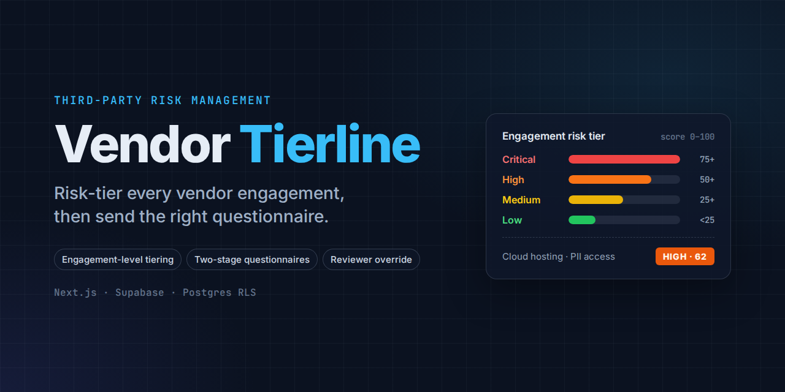

# Vendor Tierline

Third-party risk tiering and vendor questionnaires.

Vendor Tierline scores each vendor **engagement** (not just the vendor) against a tiering questionnaire, maps the result to an org-configurable risk tier, and routes the engagement to the follow-up questionnaire for that tier. A reviewer confirms or overrides the computed tier before it becomes final.

## How it works

1. **Tiering questionnaire.** Multiple-choice questions grouped by risk factor (data sensitivity, regulatory exposure, cloud/infrastructure dependency, fourth-party exposure, breach history, service criticality, access level). Answers are weighted and normalized into a score.
2. **Tier assignment.** The score maps to a risk tier (Critical / High / Medium / Low by default, configurable per org). The computed tier and the reviewer's final tier are stored separately, with an override reason.
3. **Follow-up questionnaire.** Each tier has its own follow-up template. The reviewer sends it once the tier is confirmed.

Vendors can fill questionnaires through a token link without an account, or an internal user can complete them on the vendor's behalf.

## Status

Early build. The two-stage questionnaire design is finalized ([architecture](docs/architecture.md)); implementation is in progress.

## Stack

- Next.js (App Router) and Tailwind CSS
- Supabase: Postgres, Auth, and row-level security scoped by organization membership
- Vercel for hosting

## Local development

Create `.env.local` with your Supabase project values:

```bash
NEXT_PUBLIC_SUPABASE_URL=...
NEXT_PUBLIC_SUPABASE_PUBLISHABLE_KEY=...
```

Then:

```bash
npm install
npm run dev
```

Open http://localhost:3000.
