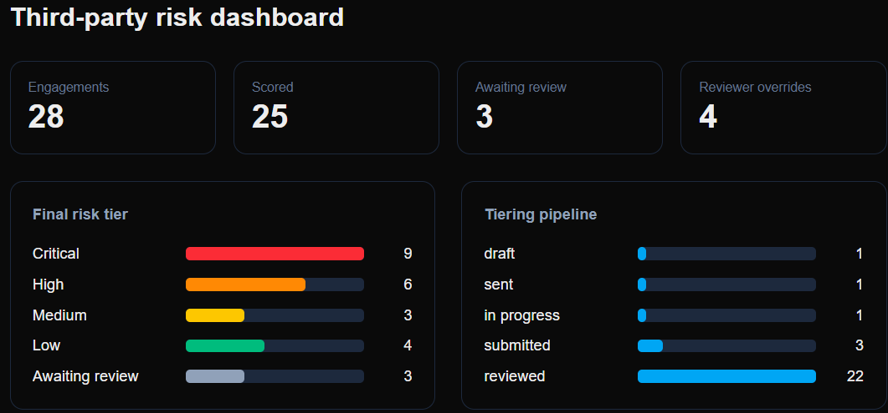

# Vendor Tierline

Third-party risk tiering and vendor questionnaires.

Vendor Tierline scores each vendor **engagement** (not just the vendor) against a tiering questionnaire, maps the result to an org-configurable risk tier, and routes the engagement to the follow-up questionnaire for that tier. A reviewer confirms or overrides the computed tier before it becomes final.

## How it works

1. **Tiering questionnaire.** Multiple-choice questions grouped by risk factor (data sensitivity, regulatory exposure, cloud/infrastructure dependency, fourth-party exposure, breach history, service criticality, access level). Answers are weighted and normalized into a score.
2. **Tier assignment.** The score maps to a risk tier (Critical / High / Medium / Low by default, configurable per org). The computed tier and the reviewer's final tier are stored separately, with an override reason.
3. **Follow-up questionnaire.** Each tier has its own follow-up template. The reviewer sends it once the tier is confirmed.

Vendors can fill questionnaires through a token link without an account, or an internal user can complete them on the vendor's behalf.

## Insights dashboard



The Insights page shows the final tier mix, the tiering pipeline, monthly intake, the reviewer-override audit trail, and aging of open follow-ups. It reads from `dash_*` database views that respect each organization's row-level security. The screenshot uses fictional demo data.

## Status

**v1.0** (23 Sep 2026). The two-stage flow from the [architecture](docs/architecture.md) is live: vendor token links, internal fill, scoring, reviewer confirm/override, tier-mapped follow-ups, a getting-started checklist, and dark mode. Schema changes live in `supabase/migrations/`.

## Stack

- Next.js (App Router) and Tailwind CSS
- Supabase: Postgres, Auth, and row-level security scoped by organization membership
- Vercel for hosting

## Local development

Create `.env.local` with your Supabase project values:

```bash
NEXT_PUBLIC_SUPABASE_URL=...
NEXT_PUBLIC_SUPABASE_PUBLISHABLE_KEY=...
```

Then:

```bash
npm install
npm run dev
```

Open http://localhost:3000.

## License

Vendor Tierline is source-available under the [Business Source License 1.1](LICENSE).

- **Allowed:** reading the code, running it locally, evaluation, learning, research, and testing.
- **Not allowed without a commercial license:** production use, including offering it as a hosted service or using it to run a commercial vendor risk offering.
- **Converts to open source:** on 2030-09-30, the code converts to the Apache License 2.0.

For commercial licensing, contact [Girish Nair](https://github.com/garynair).
