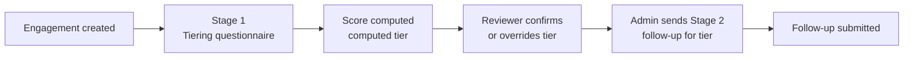

# Vendor Tierline — Architecture

*Last updated 2 Oct 2026 · Girish Nair*

## Overview

Vendor Tierline is a two-stage vendor risk questionnaire portal: each vendor engagement is tiered by a scored questionnaire, confirmed by a reviewer, then sent the follow-up questionnaire for its tier.

It replaces the original Phase 1 "practice lab", where a GRC learner rehearsed judgment calls against a rubric scored by keyword matching. The foundation from Phase 1 (organizations, memberships, frameworks, controls, org-scoped RLS) carries over unchanged.

**Status:** design finalized 22 Sep 2026; v1.0 shipped 23 Sep 2026 (PR #1); v1.1 (workspaces, users and roles, bot protection) shipped 2 Oct 2026. Schema history is in `supabase/migrations/`; the Phase 1 tables have been dropped.

## Core model: vendors and engagements

Risk is tiered per **engagement**, not per vendor, because one vendor can provide several services with very different risk exposure.

- **Vendor:** the third-party company.
- **Engagement** (`vendor_engagements`): one service or relationship with that vendor. Each engagement is tiered on its own.
- **Vendor summary tier:** the highest tier across the vendor's active engagements.

## Two-stage flow

Every engagement goes through a tiering questionnaire, a human review, and then one follow-up questionnaire chosen by its final tier.



1. **Stage 1: tiering questionnaire.** One org-wide template (`type = 'tiering'`). Questions are grouped by risk factor: data sensitivity, regulatory exposure, cloud/infrastructure dependency, fourth-party exposure, breach history, service criticality, access level, plus an extensible "other". Every question is multiple choice and required; N/A is just another option with its own points.
2. **Human review.** The computed tier is not final until a reviewer confirms it or overrides it with a reason. A single reviewer decides in v1.
3. **Stage 2: follow-up questionnaire.** One fixed template per tier (`template_tier_mappings`), not an adaptive or branching form. The admin reviews Stage 1 and triggers Stage 2 manually (no auto-send), and can override which template is used.

## Scoring and risk tiers

The Stage 1 score is a weighted sum normalized against the maximum possible, then mapped to one of four org-configurable tiers.

```latex
\text{score} = \frac{\sum_i \text{points}(\text{option}_i) \times \text{weight}(\text{question}_i)}{\text{max\_possible}}
```

- Because every question is required and N/A carries points, `max_possible` is fully known at submit time, so there's no partial-answer ambiguity.
- Tiers live in `risk_tiers`: Critical, High, Medium and Low by default, with thresholds configured per org rather than hardcoded.
- `assessment_scores` stores both tiers side by side:

| Field | Meaning |
| --- | --- |
| `computed_tier_id` | The algorithm's output, never edited |
| `final_tier_id` | The reviewer's decision (nullable until reviewed) |
| `overridden_by`, `override_reason` | Who overrode the computed tier, and why |

## Fill modes

The tiering questionnaire can be completed two ways, and both write to the same `assessments` and `assessment_answers` rows.

| Mode | Who | How | `filled_by_type` |
| --- | --- | --- | --- |
| Vendor self-serve | The vendor | Token link at `assess/[token]`, no login | vendor |
| Internal | An org user on the vendor's behalf | Authenticated dashboard | internal |

## Access and security model

Org users go through ordinary row-level security; vendors never touch tables directly and only call three narrow database functions.

- **Org side:** RLS scoped by `current_user_role(org_id)`, the same `SECURITY DEFINER` helper as Phase 1. Roles: admin, practitioner, learner.
- **Vendor side:** `SECURITY DEFINER` RPCs only: `get_assessment_for_token`, `save_assessment_answer` (autosave, so vendors can resume) and `submit_assessment`.
- **The `anon` role has zero direct grants** on the underlying tables, only `EXECUTE` on those RPCs.
- **Cross-org check:** `get_assessment_for_token` must validate the full chain (assessment → engagement → vendor → org, and template → org) so a token can't reach another org's data. This is the class of RLS mistake hit in Phase 1.
- **Tokens:** carry `expires_at`, and are invalidated or downgraded to view-only after submission, to limit replay of a leaked link.

## Workspaces, users and roles (v1.1)

- **Self-service workspaces.** Sign-up creates a sandbox organization through `create_sandbox_workspace`, with the user as admin. Risk tiers and questionnaires are always copied from the template organization (the public demo); the sample vendors, assessments and scores are copied too unless the user chooses to start empty. `load_sample_data` adds them later. Copied history is date-shifted so aging metrics look current, and vendor invite tokens are never copied. One workspace per account.
- **Membership writes go through checked functions only.** Direct writes to `memberships` are not granted. `set_member_role` and `remove_member` refuse to leave a workspace without an admin and don't let admins remove themselves; every change is written to `membership_events`. `org_members` masks emails for non-admins, because the public demo account can read its organization's member list.
- **Invites.** `create_org_invite` returns a one-time token and stores only its SHA-256 hash, with a 7-day expiry. `/join/[token]` shows the invite before sign-in, keeps it through sign-up and email confirmation, and `accept_org_invite` adds the membership.
- **Inactivity cleanup.** A daily Vercel Cron job calls `sandbox_maintenance` with a shared secret (only its hash is stored in the database). A sandbox idle for 23 days gets a reminder email; it's deleted only if it is still idle 7 days after a reminder was actually sent. The template organization is never eligible.
- **Sign-in protection.** Cloudflare Turnstile tokens are required by Supabase Auth on sign-in and sign-up. Passwords need 10+ characters with lowercase, uppercase, digits and symbols. The email confirmation link opens a page with a button, so link scanners that pre-open URLs can't use up the one-time token.

## Template drift handling

Templates stay editable after publishing, and historical scores are protected by snapshotting. When `submit_assessment` runs, the points and weights actually used are copied into `assessment_answers`, so editing a live template later never changes a past score. There is no versioning or clone UI in v1.

## Schema

Ten new tables sit on top of the Phase 1 foundation; three Phase 1 tables are removed once they land.

| Table | Key columns / purpose |
| --- | --- |
| `vendors` | The third-party company |
| `vendor_engagements` | One per service or relationship; the unit that gets tiered |
| `risk_tiers` | Org-configurable tiers and thresholds (default Critical, High, Medium, Low) |
| `questionnaire_templates` | `type`: tiering or followup |
| `questionnaire_questions` | `category`, `weight` |
| `question_options` | `points` (N/A is an option too) |
| `template_tier_mappings` | Which follow-up template each tier gets |
| `assessments` | `engagement_id`, `filled_by_type`, `invite_token` (nullable), `status`, `parent_assessment_id` (nullable), `expires_at` |
| `assessment_answers` | Answers, plus the points and weights snapshotted at submit |
| `assessment_scores` | `computed_tier_id`, `final_tier_id`, `overridden_by`, `override_reason`, `reviewed_by`, `reviewed_at` |

**Kept from Phase 1:** `organizations`, `memberships`, `frameworks`, `controls`, and the `current_user_role(org_id)` helper.

**Removed:** `scenarios`, `submissions`, `scores`, and the keyword scorer (23 Sep 2026).

## Out of scope for v1

These are deliberate gaps, deferred so the core flow can ship:

- **Reassessment and renewal cadence:** no recurrence concept (such as annual re-tiering) yet.
- **Full audit log of assessment status transitions:** only `reviewed_by` and `reviewed_at` are captured for assessments (membership changes are logged in `membership_events`).
- **Multi-stakeholder approval:** no committee sign-off across legal, GRC, IT, procurement, HR and leadership. One reviewer decides in v1.
- **Multiple workspaces per account:** an account belongs to one organization; someone who already has a workspace can't accept an invite to another.
- **Free-text or evidence answers:** follow-up questions are multiple choice only; no text answers or file uploads.
- **AI-vendor risk factor:** no questions yet for vendors that build AI into their service (e.g. model use on customer data, EU AI Act risk category, NIST AI RMF / ISO/IEC 42001 alignment). Candidate for the next iteration.

## Roadmap: v1.2 candidates

**Framework packs and vendor assurance evidence.** Two separate concepts, kept separate in the design:

- **Program frameworks** (what the organization's TPRM program aligns to): selectable packs, starting with NIST CSF 2.0 GV.SC and adding ISO/IEC 27001:2022 A.5.19 to A.5.22, NIST SP 800-161, and later sector packs (HIPAA, PCI DSS 12.8, DORA, NYDFS 500.11). Admins enable the packs that apply; follow-up questions are tagged to controls, with a per-vendor coverage view. Builds on the existing `frameworks` and `controls` tables.
- **Vendor assurance evidence** (what the vendor provides): SOC 2 Type II reports, ISO/IEC 27001 certificates, pen test summaries, SIG or CAIQ responses. SOC 2 is an attestation report, not a framework the program applies. The reviewer records report period, scope, exceptions, and complementary user-entity controls (CUECs), and marks which follow-up questions the evidence satisfies.

Open questions: file storage and access control for uploaded reports; who maintains control mappings (mapping accuracy is GRC judgment, so start with one pack mapped carefully); whether vendors can self-report framework alignment or only the reviewer records it.

**Other candidates:** AI-vendor risk factor (above); remove sample data from Settings; multiple workspaces per account.

### Sequencing

1. **v1.2a: reports and richer demo data** (low effort, high visibility).
   - Reports: executive TPRM summary (PDF), vendor risk register export (CSV/Excel), tier trend over time, overdue reassessments, fourth-party concentration (for example, several Critical vendors relying on the same cloud provider).
   - Demo data: more industries, reassessment history (a vendor moving from High to Medium), fourth-party links, and sample SOC 2 evidence once v1.2b lands.
2. **v1.2b: framework packs and vendor assurance evidence** (described above).
3. **v1.3: governed AI assistance.** Every AI output is a suggestion a reviewer confirms; nothing changes a tier automatically. Outputs are logged with model, prompt version, and sources, and the controls are mapped to NIST AI RMF so the feature is itself an example of AI governance.
   - **SOC 2 report reader:** extracts period, scope, exceptions, and CUECs from an uploaded report for reviewer confirmation. Builds on v1.2b evidence uploads.
   - **Vendor due-diligence brief:** searches public sources (breach news, security.txt, published certifications, sanctions lists) and drafts a brief where every claim cites its source. Web content is treated as untrusted input (prompt-injection risk).
   - **Answer consistency check:** flags vendor answers that contradict each other or the vendor's SOC 2 report. Advisory only.
   - LLM calls cost money per use, so the public demo would use rate limits or pre-generated sample outputs.

### Considered and deferred

- **Embeddable intake form for other websites** (vendor or requester intake on a company's procurement page). Deferred: it adds a security surface (clickjacking, cross-origin requests, spam, per-customer domain allowlists), real deployments would be production use under the Business Source License, and it has little demonstration value in a public demo. Revisit only if the project becomes a product.

Guiding principle: depth in a few areas (TPRM workflow, assurance evidence, governed AI) over a long list of shallow features.

## Infrastructure and build notes

| Piece | Detail |
| --- | --- |
| Repo | `garynair/vendor-tierline` |
| Stack | Next.js 16, Tailwind, Supabase |
| Database | Supabase (Postgres, Auth, row-level security) |
| Hosting | Vercel, auto-deploys from `main`; live at [vendor-tierline.vercel.app](https://vendor-tierline.vercel.app) |
| Scheduled jobs | Vercel Cron: `/api/keepalive` three times a day (keeps the free-tier database from pausing) and `/api/sandbox-maintenance` daily; both require `CRON_SECRET` |
| Email | Supabase Auth sends through Resend SMTP from a verified sending domain; reminder emails use the Resend API |

## Launch checklist

Status as of v1.1 (2 Oct 2026). All items are done.

- [x] Custom SMTP with a verified sending domain (SPF, DKIM, DMARC), so confirmation email reaches the inbox.
- [x] Email confirmation required, with a branded template and a scanner-safe confirm page.
- [x] Password policy: 10+ characters with lowercase, uppercase, digits and symbols.
- [x] Bot protection (Cloudflare Turnstile) on sign-in and sign-up.
- [x] Database keep-alive and inactive-workspace cleanup on a schedule.
- [x] Public demo contains only fictional vendors (`.example` domains).

Not available on the free plan: leaked-password checks against known breaches (Supabase Pro).
