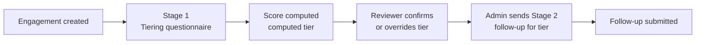

# Vendor Tierline — Architecture

*Last updated 23 Sep 2026 · Girish Nair*

## Overview

Vendor Tierline is a two-stage vendor risk questionnaire portal: each vendor engagement is tiered by a scored questionnaire, confirmed by a reviewer, then sent the follow-up questionnaire for its tier.

It replaces the original Phase 1 "practice lab", where a GRC learner rehearsed judgment calls against a rubric scored by keyword matching. The foundation from Phase 1 (organizations, memberships, frameworks, controls, org-scoped RLS) carries over unchanged.

**Status:** design finalized 22 Sep 2026; shipped 23 Sep 2026 (PR #1). Schema history is in `supabase/migrations/`; the Phase 1 tables have been dropped.

## Core model: vendors and engagements

Risk is tiered per **engagement**, not per vendor, because one vendor can provide several services with very different risk exposure.

- **Vendor:** the third-party company.
- **Engagement** (`vendor_engagements`): one service or relationship with that vendor. Each engagement is tiered on its own.
- **Vendor summary tier:** the highest tier across the vendor's active engagements.

## Two-stage flow

Every engagement goes through a tiering questionnaire, a human review, and then one follow-up questionnaire chosen by its final tier.



1. **Stage 1: tiering questionnaire.** One org-wide template (`type = 'tiering'`). Questions are grouped by risk factor: data sensitivity, regulatory exposure, cloud/infrastructure dependency, fourth-party exposure, breach history, service criticality, access level, plus an extensible "other". Every question is multiple choice and required; N/A is just another option with its own points.
2. **Human review.** The computed tier is not final until a reviewer confirms it or overrides it with a reason. A single reviewer decides in v1.
3. **Stage 2: follow-up questionnaire.** One fixed template per tier (`template_tier_mappings`), not an adaptive or branching form. The admin reviews Stage 1 and triggers Stage 2 manually (no auto-send), and can override which template is used.

## Scoring and risk tiers

The Stage 1 score is a weighted sum normalized against the maximum possible, then mapped to one of four org-configurable tiers.

```latex
\text{score} = \frac{\sum_i \text{points}(\text{option}_i) \times \text{weight}(\text{question}_i)}{\text{max\_possible}}
```

- Because every question is required and N/A carries points, `max_possible` is fully known at submit time, so there's no partial-answer ambiguity.
- Tiers live in `risk_tiers`: Critical, High, Medium and Low by default, with thresholds configured per org rather than hardcoded.
- `assessment_scores` stores both tiers side by side:

| Field | Meaning |
| --- | --- |
| `computed_tier_id` | The algorithm's output, never edited |
| `final_tier_id` | The reviewer's decision (nullable until reviewed) |
| `overridden_by`, `override_reason` | Who overrode the computed tier, and why |

## Fill modes

The tiering questionnaire can be completed two ways, and both write to the same `assessments` and `assessment_answers` rows.

| Mode | Who | How | `filled_by_type` |
| --- | --- | --- | --- |
| Vendor self-serve | The vendor | Token link at `assess/[token]`, no login | vendor |
| Internal | An org user on the vendor's behalf | Authenticated dashboard | internal |

## Access and security model

Org users go through ordinary row-level security; vendors never touch tables directly and only call three narrow database functions.

- **Org side:** RLS scoped by `current_user_role(org_id)`, the same `SECURITY DEFINER` helper as Phase 1. Roles: admin, practitioner, learner.
- **Vendor side:** `SECURITY DEFINER` RPCs only: `get_assessment_for_token`, `save_assessment_answer` (autosave, so vendors can resume) and `submit_assessment`.
- **The `anon` role has zero direct grants** on the underlying tables, only `EXECUTE` on those RPCs.
- **Cross-org check:** `get_assessment_for_token` must validate the full chain (assessment → engagement → vendor → org, and template → org) so a token can't reach another org's data. This is the class of RLS mistake hit in Phase 1.
- **Tokens:** carry `expires_at`, and are invalidated or downgraded to view-only after submission, to limit replay of a leaked link.

## Template drift handling

Templates stay editable after publishing, and historical scores are protected by snapshotting. When `submit_assessment` runs, the points and weights actually used are copied into `assessment_answers`, so editing a live template later never changes a past score. There is no versioning or clone UI in v1.

## Schema

Ten new tables sit on top of the Phase 1 foundation; three Phase 1 tables are removed once they land.

| Table | Key columns / purpose |
| --- | --- |
| `vendors` | The third-party company |
| `vendor_engagements` | One per service or relationship; the unit that gets tiered |
| `risk_tiers` | Org-configurable tiers and thresholds (default Critical, High, Medium, Low) |
| `questionnaire_templates` | `type`: tiering or followup |
| `questionnaire_questions` | `category`, `weight` |
| `question_options` | `points` (N/A is an option too) |
| `template_tier_mappings` | Which follow-up template each tier gets |
| `assessments` | `engagement_id`, `filled_by_type`, `invite_token` (nullable), `status`, `parent_assessment_id` (nullable), `expires_at` |
| `assessment_answers` | Answers, plus the points and weights snapshotted at submit |
| `assessment_scores` | `computed_tier_id`, `final_tier_id`, `overridden_by`, `override_reason`, `reviewed_by`, `reviewed_at` |

**Kept from Phase 1:** `organizations`, `memberships`, `frameworks`, `controls`, and the `current_user_role(org_id)` helper.

**Removed:** `scenarios`, `submissions`, `scores`, and the keyword scorer (23 Sep 2026).

## Out of scope for v1

These are deliberate gaps, deferred so the core flow can ship:

- **Reassessment and renewal cadence:** no recurrence concept (such as annual re-tiering) yet.
- **Full audit log of status transitions:** only `reviewed_by` and `reviewed_at` are captured; there is no generic event table.
- **Multi-stakeholder approval:** no committee sign-off across legal, GRC, IT, procurement, HR and leadership. One reviewer decides in v1.
- **Teammate invites:** one organization per user, and there's no way to invite others into an org yet.
- **Free-text or evidence answers:** follow-up questions are multiple choice only; no text answers or file uploads.

## Infrastructure and build notes

| Piece | Detail |
| --- | --- |
| Repo | `garynair/vendor-tierline` (private); local `~/projects/vendor-tierline` |
| Stack | Next.js 16, Tailwind, Supabase |
| Database | Supabase project `vendor-tierline` (`evmvclibywkkwdusuded`, us-east-1) |
| Hosting | Vercel project `vendor-tierline` (team axionsec), auto-deploys from `main`; live at [vendor-tierline.vercel.app](https://vendor-tierline.vercel.app) |
| Agent skills | `supabase` and `supabase-postgres-best-practices` in `.claude/skills/` |

## Launch checklist

Status as of v1.0 (23 Sep 2026). Items marked *dashboard* are Supabase or Vercel settings, not code.

**Done**

- [x] Retire `grc-practice-lab.vercel.app`: removed from the Vercel project; no Supabase redirect URL pointed at it.
- [x] Supabase Site URL set to `https://vendor-tierline.vercel.app`, with `https://vendor-tierline.vercel.app/**` as a redirect URL.
- [x] App support for email confirmation: `/auth/confirm` verifies the emailed token, and `/auth/error` handles expired or used links.

**Open**

- [ ] **Custom SMTP** *(dashboard: Authentication → Emails → SMTP)*. Required before turning on confirmation: from 26 Sep 2026, Supabase's default sender only emails members of the Supabase organization. Use a provider such as Resend with a verified sending domain.
- [ ] **Confirm signup template** *(dashboard: Authentication → Emails → Confirm signup)*. Change the link to `{{ .SiteURL }}/auth/confirm?token_hash={{ .TokenHash }}&type=email`.
- [ ] **Turn on Confirm email** *(dashboard)*. Only after the two items above; until then signups log in immediately.
- [ ] **Password rules** *(dashboard: Authentication → Sign In / Providers → Email)*. Minimum length 10, letters and digits, to match the signup form.
- [ ] **Leaked-password protection**. Requires the Supabase Pro plan; the project is on Free.

Testers can use the app now with confirmation off. Each signup gets its own private organization.
